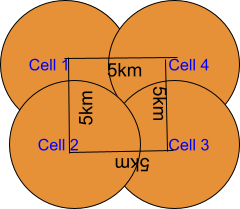

# 📶 LTE - using - NS3 🌐
> NS3 LTE SIMULATION

The objective of this Project is to understand and change code of LTE Schedulers algorithms in
NS-3 for necessary stats collection. Further, I also evaluated and compared the performance of
different Scheduler algorithms.

Created a topology as shown in the below figure. P-GW and Remote Host are added to this topology and
connected them with point-to-point 1 Gbps links.

## ✨Basic Configuration of eNBs and their UEs with the parameters are as follows

| 	Simulation Parameter	          | 	Value	                                                    |
| 	      :-----:	                  | 	:-----:	                                                    |
| 	    Number of UEs                 | 	10 per eNB; 1 Downlink UDP Flow per UEfrom the Remote Host	|
| 	       Number of eNBs	          | 	4	|
| 	Inter distance between eNBs	      | 	5 KM	|
| 	eNB Tx Power	                  | 	40 dBm (10 Watt)	|
| 	Application Type	              | 	UDP	|
|    Full buffer case (UDP Traffic)   |  1500 bytes per every 1ms by UDP; Each UE is configured with 1 DL UDP flow of 12Mbps|
| Non Full buffer case (UDP Traffic)  | 1500 bytes per every 10ms by UDP; EachUE is configured with 1 DL UDP flow of 1.2Mbps|
| 	UE mobility speeds	              | 0, 10 m/s; where in a given expt all UEs are configured with one of these two speeds|
| 	UE mobility model	              | 	RandomWalk2d Mobility	|
|    UEs placement in a Cell          |  Random disc placement within 500m radius of eNB|
|    # of RBs                         |  50 in DL and 50 in UL (LTE FDD) |
| UE attachment to eNB                | Automatic to one of eNBs based on received signal strength, so handovers may take place during mobility|
| 	Total simulation time	          | 	30 seconds	|
|    Number of seeds per experiment   |  5 seeds/variants |

Compared Proportional Fair (PF), Round Robin (RR), Max Throughput (MT) and Priority Set
Scheduler (PSS) available in NS-3 LENA LTE module by creating a 4-cell LTE network as
shown above with the simulation parameters given in the table.

## The following graphs have being generated for better understanding and easability of comparision of various parameters in the simulation
#### Graph 1: SINR Radio Environment Map (REM) of 4-cell topology given above.

###### I have implemented all the parameters which are crucial for the eNBs which can show vairiations in the REM plot.
I have used <RadioEnvironmentMapHelper> to assign the parameters and make it work. 
After running **Asg1** file in ns3 ques1 folder a file named **rem.out** will be generated in the same directory (checkout in [ns3 ques1](https://github.com/Harshavardhanpentakota/LTE-using-NS3/tree/main/ns3%20ques1))
which contains all the Data to generate the REM plot with X,Y positions and the SINR values, which can be done using any plotting tool. I have used gnuplot for this.

The Generated Output is here below 👇.

The Colour Gradient Bar shows the intensity of SINR values over a particular area. For better understanding - The eNBs are placed at (0,0),(0,5000),(5000,0),(5000,5000).

#### Graph 2: X-axis: Speed (0, 10) m/s; Y-axis: (Average Aggregate System throughput) with bars for four scheduler algorithms for full buffer scenario. Getting sum of throughputs of all 4 cells (i.e., all 40 UEs flows) in different runs by varying seed values and then get the average of that for plotting.

###### Necessary implementation of all other parameters are done, here we start the actual simulation with mobility of UEs and complex implementations like Handovers, Scheduling algorithms, Seeds etc

